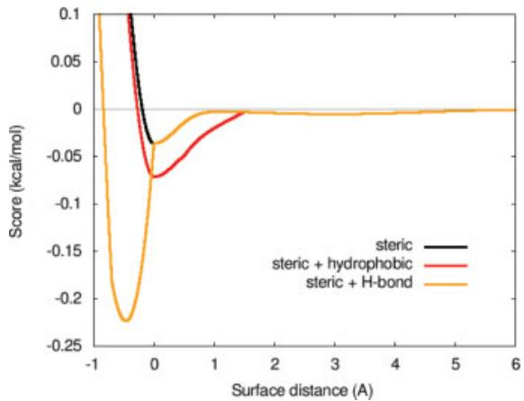
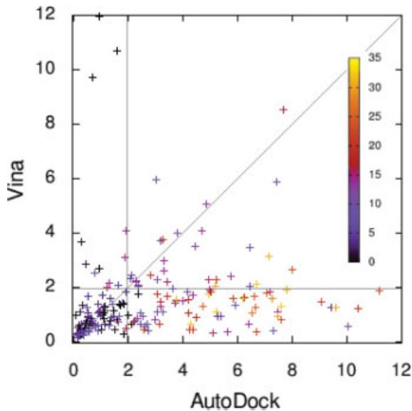
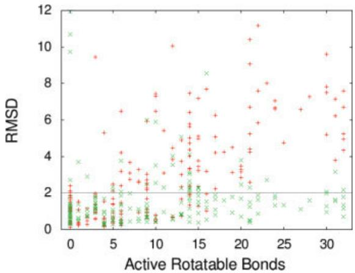
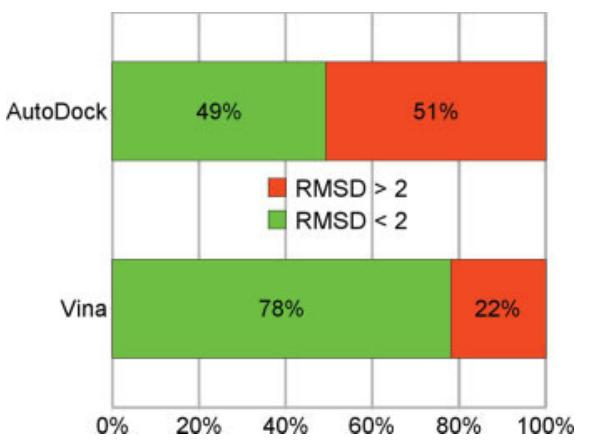
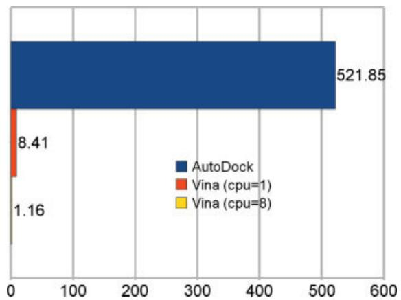
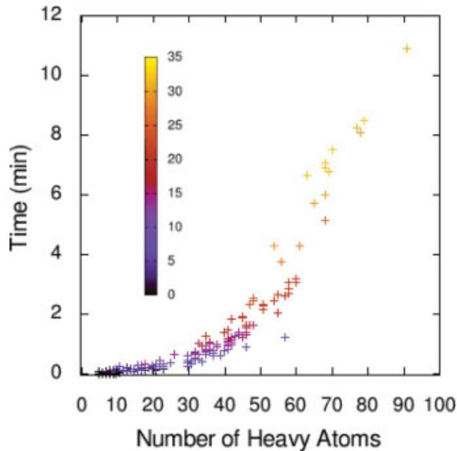
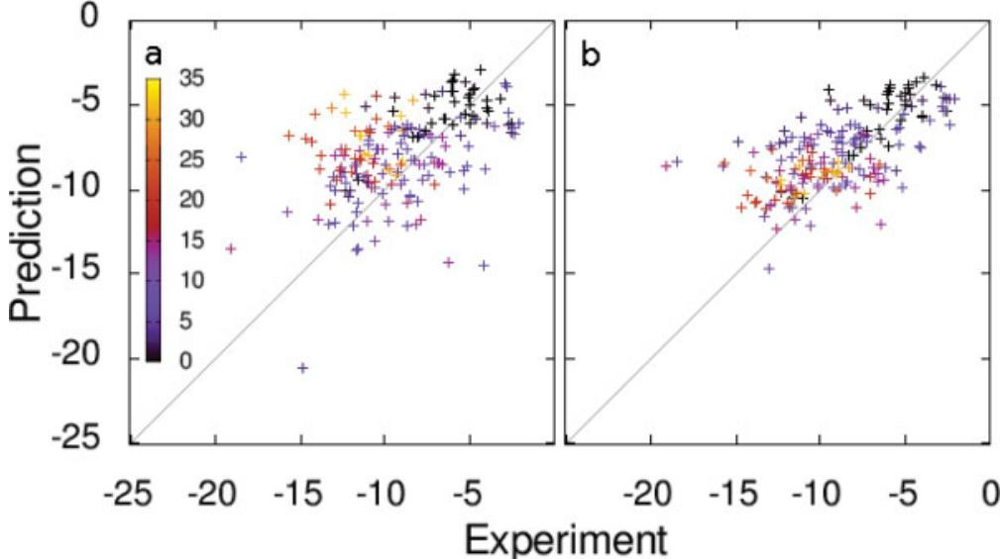

# Software News and Update AutoDock Vina: Improving the Speed and Accuracy of Docking with a New Scoring Function, Efficient Optimization, and Multithreading

OLEG TROTT, ARTHUR J. OLSON Department of Molecular Biology, The Scripps Research Institute, La Jolla, California

Received 3 March 2009; Accepted 21 April 2009

DOI 10.1002/jcc.21334

Published online 4 June 2009 in Wiley InterScience (www.interscience.wiley.com).

Abstract: AutoDock Vina, a new program for molecular docking and virtual screening, is presented. AutoDock Vina achieves an approximately two orders of magnitude speed-up compared with the molecular docking software previously developed in our lab (AutoDock 4), while also significantly improving the accuracy of the binding mode predictions, judging by our tests on the training set used in AutoDock 4 development. Further speed-up is achieved from parallelism, by using multithreading on multicore machines. AutoDock Vina automatically calculates the grid maps and clusters the results in a way transparent to the user.

© 2009 Wiley Periodicals, Inc. J Comput Chem 31: 455–461, 2010

Key words: AutoDock; molecular docking; virtual screening; computer-aided drug design; multithreading; scoring function

## Introduction

Molecular docking is a computational procedure that attempts to predict noncovalent binding of macromolecules or, more frequently, of a macromolecule (receptor) and a small molecule (ligand) efficiently, starting with their unbound structures, structures obtained from MD simulations, or homology modeling, etc. The goal is to predict the bound conformations and the binding affinity.

The prediction of binding of small molecules to proteins is of particular practical importance because it is used to screen virtual libraries of drug-like molecules to obtain leads for further drug development. Docking can also be used to try to predict the bound conformation of known binders, when the experimental holo structures are unavailable.

One is interested in maximizing the accuracy of these predictions while minimizing the computer time they take, because the computational resources spent on docking are considerable. For example, hundreds of thousands of computers are used for running docking in FightAIDS@Home and similar projects.2

## Theory

In the spectrum of computational approaches to modeling receptorligand binding,

a. molecular dynamics with explicit solvent,

b. molecular dynamics and molecular mechanics with implicit solvent, and

c. molecular docking

can be seen as making an increasing trade-off of the representational detail for computational speed.3

Among the assumptions made by these approaches is the commitment to a particular protonation state of and charge distribution in the molecules that do not change between, for example, their bound and unbound states. Additionally, docking generally assumes much or all of the receptor rigid, the covalent lengths, and angles constant, while considering a chosen set of covalent bonds freely rotatable (referred to as active rotatable bonds here).

Importantly, although molecular dynamics directly deals with energies (referred to as force fields in chemistry), docking is ultimately interested in reproducing chemical potentials, which determine the bound conformation preference and the free energy of binding. It is a qualitatively different concept governed not only by the minima in the energy profile but also by the shape of the profile and the temperature.4, 5

Docking programs generally use a scoring function, which can be seen as an attempt to approximate the standard chemical potentials of the system. When the superficially physics-based terms like the 6–12 van der Waals interactions and Coulomb energies are used in the scoring function, they need to be significantly empirically weighted, in part, to account for this difference between energies and free energies.4, 5

The aforementioned considerations should make it rather unsurprising when such superficially physics-based scoring functions do not necessarily perform better than the alternatives.

We see our approach to the scoring function as more of “machine learning” than directly physics-based in its nature. It is ultimately justified by its performance on test problems rather than by theoretical considerations following some, possibly too strong, approximating assumptions.

## Methods

## Scoring Function

The general functional form of the conformation-dependent part of the scoring function AutoDock Vina (referred to as Vina here) is designed to work with is

$$
c = \sum _ { i < j } f _ { t _ { i } t _ { j } } ( r _ { i j } ) ,\tag{1}
$$

where the summation is over all of the pairs of atoms that can move relative to each other, normally excluding 1–4 interactions, i.e., atoms separated by three consecutive covalent bonds. Here, each atom i is assigned a type $t _ { i } ,$ and a symmetric set of interaction functions $f _ { t _ { i } t _ { j } }$ of the interatomic distance $r _ { i j }$ should be defined.

This value can be seen as a sum ofintermolecular and intramolecular contributions:

$$
c = c _ { \mathrm { i n t e r } } + c _ { \mathrm { i n t r a } } .\tag{2}
$$

The optimization algorithm, described in the following section, attempts to find the global minimum of c and other low-scoring conformations, which it then ranks.

The predicted free energy of binding is calculated from the intermolecular part of the lowest-scoring conformation, designated as 1:

$$
s _ { 1 } = g ( c _ { 1 } - c _ { \mathrm { i n t r a l } } ) = g ( c _ { \mathrm { i n t e r 1 } } ) ,\tag{3}
$$

where the function g can be an arbitrary strictly increasing smooth possibly nonlinear function.

In the output, other low-scoring conformations are also formally given s values, but, to preserve the ranking, using $c _ { \mathrm { i n t r a } }$ of the best binding mode:

$$
s _ { i } = g ( c _ { i } - c _ { \mathrm { i n t r a l } } ) .\tag{4}
$$

For modularity reasons, much of the program does not rely on any particular functional form of $f _ { t _ { i } t _ { j } }$ interactions or $g .$ Essentially, these functions are passed as a parameter for the rest of the code. Additionally, the program was designed so that alternative atom typing schemes could potentially be used, such as the AutoDock 4 atom typing6 or SYBIL-based types.7

The particular implementation of the scoring function that will be presented here was mostly inspired by X-score,8 and, like

Table 1. Scoring Function Weights and Terms.
<table><tr><td>Weight</td><td>Term</td></tr><tr><td>-0.0356</td><td>gauss1</td></tr><tr><td>-0.00516</td><td>gauss2</td></tr><tr><td>0.840</td><td>Repulsion</td></tr><tr><td>-0.0351</td><td>Hydrophobic</td></tr><tr><td>-0.587</td><td>Hydrogen bonding</td></tr><tr><td>0.0585</td><td> $N _ { \mathrm { r o t } }$ </td></tr></table>

X-score, was tuned using the PDBbind.9, 10 However, some terms are different from X-score, and, in tuning the scoring function, we went beyond linear regression. Additionally, it should be noted that Vina ranks the conformations according to eq. (2), or, equivalently, eq. (4), whereas X-score only counts intermolecular contributions.8 As far as we are aware, X-score has not been implemented in a docking program, and ignoring internal constraints may potentially lead the optimization algorithm to find severely internally clashed structures.

The derivation of our scoring function combines certain advantages of knowledge-based potentials and empirical scoring functions: it extracts empirical information from both the conformational preferences of the receptor-ligand complexes and the experimental affinity measurements. The scoring function derivation will be described in a separate publication. This section merely defines it.

The atom typing scheme follows that of X-score. The hydrogen atoms are not considered explicitly, other than for atom typing, and are omitted from eq. (1).

The interaction functions $f _ { t _ { i } t _ { j } }$ are defined relative to the surface distance $d _ { i j } = r _ { i j } - R _ { t _ { i } } - R _ { t _ { j } } $ , as in Jain11:

$$
f _ { t _ { i } t _ { j } } ( r _ { i j } ) \equiv h _ { t _ { i } t _ { j } } ( d _ { i j } ) ,\tag{5}
$$

where $R _ { t }$ is the van der Waals radius of atom type t.

In our scoring function, $h _ { t _ { i } t _ { j } }$ is a weighted sum of steric interactions (the first three terms in Table 1), identical for all atom pairs, hydrophobic interaction between hydrophobic atoms, and, where applicable, hydrogen bonding.

The weights are shown in Table 1. The steric terms are as follows:

$$
\mathrm { g a u s s } _ { 1 } ( d ) = e ^ { - ( d / 0 . 5 \mathring { \mathrm { A } } ) ^ { 2 } }\tag{6}
$$

$$
\mathrm { g a u s s } _ { 2 } ( d ) = e ^ { - ( ( d - 3 \hat { \mathrm { A } } ) / 2 \hat { \mathrm { A } } ) ^ { 2 } }\tag{7}
$$

$$
{ \mathrm { r e p u l s i o n } } ( d ) = { \left\{ \begin{array} { l l } { d ^ { 2 } , } & { { \mathrm { i f } } d < 0 } \\ { 0 , } & { { \mathrm { i f } } d \geq 0 } \end{array} \right. }\tag{8}
$$

The hydrophobic term equals 1, when $d \mathbf { \Phi } < 0 . 5 \mathring { \mathrm { A } } ; 0 .$ when $d \digamma >$ 1.5 Å, and is linearly interpolated between these values. The hydrogen bonding term equals 1, when $d \ < \ - 0 . 7 \mathring { \mathrm { A } } ; 0 .$ , when $d > 0 ,$ and is similarly linearly interpolated in between. Following Xscore, we formally treat metals as hydrogen bond donors. In this implementation, all interaction functions $f _ { t _ { i } t _ { j } }$ are cut off at $r _ { i j } = 8 \mathrm { \AA }$

Figure 1 shows the weighted steric terms alone, or combined with the hydrophobic or H-bonding interactions.

The conformation-independent function g was chosen to be

$$
g ( c _ { \mathrm { i n t e r } } ) = \frac { c _ { \mathrm { i n t e r } } } { 1 + w N _ { \mathrm { r o t } } } ,\tag{9}
$$

where $N _ { \mathrm { r o t } }$ is the number of active rotatable bonds between heavy atoms in the ligand and w is the associated weight.

## Optimization Algorithm

In the development of Vina, a variety of stochastic global optimization approaches were explored, including genetic algorithms,12 particle swarm optimization,13, 14 simulated annealing,15 and others, combined with various local optimization procedures and special “tricks” to speed up the optimization. Eventually, we settled on the Iterated Local Search global optimizer16, 17 similar to that by Abagyan et al.18

In this algorithm, a succession of steps consisting of a mutation and a local optimization are taken, with each step being accepted according to the Metropolis criterion. In our implementation, we use Broyden-Fletcher-Goldfarb-Shanno (BFGS)19 method for the local optimization, which is an efficient quasi-Newton method.

BFGS, like other quasi-Newton optimization methods, uses not only the value of the scoring function but also its gradient, i.e., the derivatives of the scoring function with respect to its arguments. The arguments, in our case, are the position and orientation of the ligand, as well as the values of the torsions for the active rotatable bonds in the ligand and flexible residues, if any.

These derivatives would have a simple mechanical interpretation, if the scoring function were an energy. The derivatives with respect to the position, orientation, and torsions would be the negative total force acting on the ligand, the negative total torque, and the negative torque projections, respectively, where the projections refer to the torque applied to the branch “moved” by the torsion, projected on its rotation axis.

Although it may take longer to evaluate the gradient in addition to the value of the scoring function itself, using the gradient can speed up the optimization significantly.

The number of steps in a run is determined adaptively, according to the apparent complexity of the problem, and several runs starting from random conformations are performed.

These runs can be performed concurrently, using multithreading, in Vina. This allows taking advantage of the shared-memory hardware parallelism, such as the now ubiquitous multicore CPUs. The optimization algorithm maintains a set of diverse significant minima found that are then combined from the separate runs and used during the structure refinement and clustering stage.

## Usability

Vina was designed to be compatible with the file format used for AutoDock 46 structure files: PDBQT, which can be seen as an extension of the PDB file format. This makes it easy to use Vina with the existing auxilliary software developed for AutoDock, such as AutoDock Tools, for preparing the files, choosing the search space, and viewing the results.

Additionally, manually choosing the atom types for grid maps, calculating grid map files with AutoGrid, choosing the “search parameters,” and clustering the results after docking are no longer necessary, as Vina calculates its own grid maps quickly and automatically and does not store them on the disk. It also clusters and ranks the results without exposing the user to intermediate details.

A frequently encountered source of issues for AutoDock 4 users has to do with the fixed data structure sizes in the program: the maximum number of atoms, the maximum number of rotatable bonds, the maximum grid map size, etc. These limits are fixed at compile time, and setting them higher might waste memory and time. To change these limits to meet their needs, the users are required to alter them in the source code and recompile AutoDock 4—a task too daunting and error-prone for many users. In contrast, Vina does not have any such limitations, for practical purposes. The program adapts itself to the input.

## Implementation

Scientific software, especially of the “numerical” type, generally pursues the opposing goals of being

a. a product of exploratory programming,

b. robust,

c. fast, and

d. developed within a reasonable time-frame.

To illustrate the need for exploratory programming: when work started on Vina, it was not clear what optimization algorithms or what scoring functions would be most suitable. Significant changes had to be made half-way through the development to, for example, change the atom-typing scheme from AutoDock 4 to X-Score, and to build in a framework for selecting the atom typing scheme. Exploring different optimization approaches required breaking preconceived abstraction barriers, such as when partial evaluations of the sum in eq. (1) were investigated.

To achieve these four opposing goals, modern C programming techniques were used. The way C is typically used, it spans a spectrum of languages: from C, to an object-oriented and Java-like language, to a language focused on generic programming, exception-safety, and automatic resource management via the special support for the RAII (Resource Acquisition Is Initialization) pattern in C .20

One attractive feature of generic programming in C++ that is worth noting is that “higher-level” programming does not normally have to come at a cost in performance relative to what would be achieved with a much “lower-level” and labor-intensive C solution.20, 21

The well-known downside to these techniques, within the framework of the language, is that they take dedication and years of experience applying them to master.

In Vina development, heavy emphasis was placed on utilizing generic programming, exception-safety, RAII, and, to a lesser extent, object-oriented programming, using STL21 and Boost22 libraries, where appropriate. Importantly, Boost::Thread library was used to abstract over the differences in multithreading among the supported architectures, allowing the development of platform-independent code.

  
Figure 1. Weighted scoring function term combinations. Steric interactions, steric and hydrophobic interactions, and steric and hydrogen bonding interactions, using weights from Table 1.

In all, little more than a year was spent developing the docking program, with some extra time devoted to the scoring function derivation method that will be described in a separate publication.

## Results and Discussion

The scoring function used in Vina was derived using the PDBbind data set, and the performance of Vina has been compared to that of AutoDock 4.0.1 (referred to as AutoDock here) on a set of 190 protein-ligand complexes that had been used as a training set for the AutoDock scoring function.6

In this set, the receptors are treated as rigid, and the ligands are treated as flexible molecules with the number of active rotatable bonds ranging from 0 to 32.

  
Figure 2. RMSD of the predicted bound ligand conformation from the experimental one, showing the values for Vina and Autodock. The color encodes the number of active rotatable bonds.

  
Figure 3. RMSD of the predicted bound ligand conformation from the experimental one. (Red ) Autodock; (Green ) Vina. Abscissa shows the number of active rotatable bonds.

Both Vina and AutoDock require a specification of the “search space” in the coordinate system of the receptor, within which various positions of the ligand are to be considered.

To select the search spaces for the test, for each complex, we started with the experimental bound ligand structure and created the minimal rectangular parallelepiped, aligned with the coordinate system, that includes it. Then, its sizes were increased by 10 Å in each of the three dimensions. Additionally, for each of the three dimensions, one of the two directions was chosen randomly, in which another 5 Å was added. Finally, if the size of the search space in any dimension was less than 22.5 Å, it was increased symmetrically to this value. Thus, the size of the search space in each dimension was no less than 15 Å larger than the size of the ligand, and no less than 22.5 Å total.

The final step of increasing the size of the search space in all dimensions to 22.5 Å is for consistency with the earlier tests of AutoDock on this set, where 22.5 Å sizes were chosen, and because the developers of AutoDock recommend making sure that the search space is large enough for the ligand to rotate in.23

  
Figure 4. The fraction of the 190 test complexes for which RMSD < 2 Å was achieved by AutoDock and Vina.

  
Figure 5. Average time, in minutes per complex, taken by AutoDock, single-threaded Vina and Vina with eight-way multithreading. Machines with two quad-core 2.66 GHz Xeon processors were used in the experiment. The time for AutoDock does not include the necessary initial AutoGrid run.

The preceding step of adding $5 \mathrm { \AA }$ in a random direction in each of the three dimensions is done to make sure the search space is not centered on the experimental structure, which, in case of a bias in a docking program, may artificially help it find the correct ligand conformation.

For the same reason, the conformation of the ligand, including its position, orientation, and torsions, is randomized to be unrelated to the experimental structure, yet avoiding creating self-clashes.

These randomized ligand structures, the receptor structures, and search spaces were then given to AutoDock and Vina.

For AutoDock, the same parameters were used as the ones normally used during its testing:23 fifty Lamarkian genetic algorithm runs were performed with 25 million evaluations in each, with all other parameters consitent with the defaults provided by the

  
Figure 6. Time, in minutes, taken by the multithreaded Vina run, as a function of the number of heavy atoms in the ligand. The color encodes the number of active rotatable bonds.

AutoDock GUI, AutoDock Tools. The results were clustered using an AutoDock Tools script and the largest cluster24 taken to be the predicted bound ligand structure.

For Vina, the default optimization parameters were accepted, and single-threaded execution was requested (parameter $\mathrm { \tilde { \ c p u } = 1 \tilde { \Delta } ) }$ After this Vina run, for each complex, Vina was rerun with the same random seed and eight-way multithreading (parameter “cpu = 8”). This latter Vina run produced identical results, but executed faster.

To compare the accuracy of the predictions of the experimental structure, we use a measure of distance between the experimental and predicted structures that takes into account symmetry, partial symmetry (e.g., symmetry within a rotatable branch) and nearsymmetry in a simple heuristic way. We refer to it as simply RMSD throughout the article, and its defintion is given in the Appendix.

  
Figure 7. Experimental and predicted free energies of binding (kcal/mol) for (a) AutoDock and (b) Vina. The color encodes the number of active rotatable bonds.

Figure 2 shows the RMSD values for Vina plotted against those for AutoDock, with the color of the points encoding the number of active rotatable bonds. The same data are shown differently in Figure 3.

The RMSD cutoff of 2 Å is often used as a criterion of the correct bound structure prediction.25 Using the same cutoff value, the fractions ofaccurate predictions for AutoDock and Vina are summarized in Figure 4.

It should be pointed out that, while the training set for Vina is the PDBbind refined set, and the training set for AutoDock is this much smaller 190-complex set, 74 of these 190 structures are also in PDBbind. To assay to what extent Vina’s scoring function is overfitting its training set, separate statistics were collected just for the remaining 116 complexes not in PDBbind. These showed 53 and 80% success rates for AutoDock and Vina, respectively, suggesting that no significant overfitting occurred, likely thanks to the large size of PDBbind and the sufficiently small number of adjustible parameters used in Vina.

Figure 5 summarizes the average time taken by AutoDock, Vina, and multithreaded Vina, per complex. The single-threaded runs show that Vina ran the benchmark 62 times faster than AutoDock. The multithreaded Vina run shows that Vina ran 7.25 times faster when using all eight cores available on the test machines.

Figure 6 shows how the time of the multithreaded Vina run varied with the number of heavy atoms in the ligand and the number of active rotatable bonds. Although the average time was 1.16 min per complex for the set, Vina can be considerably slower for the more complex ligands, both because the evaluation of the scoring function is clostlier, and because more of these evaluations are performed.

Figure 7 shows the predicted and experimental free energies of binding for the data set, using the predicted bound conformations. Vina achieves a comparatively low standard error of 2.85 kcal/mol, likely because of the ligands with many active rotatable bonds, for which AutoDock has difficulty finding the correct bound conformation, as can be seen in Figure 3. The standard error for the 116 complexes not in PDBbind was 2.75 kcal/mol.

## Conclusions

AutoDock Vina, a new program for molecular docking and virtual screening, has been presented. Vina uses a sophisticated gradient optimization method in its local optimization procedure. The calculation of the gradient effectively gives the optimization algorithm a “sense of direction” from a single evaluation. By using multithreading, Vina can further speed up the execution by taking advantage of multiple CPUs or CPU cores.

The evaluation of the speed and accuracy of Vina during flexible redocking of the 190 receptor-ligand complexes making up the AutoDock 4 training set showed approximately two orders of magnitude improvement in speed and a simultaneous significantly better accuracy of the binding mode prediction. In addition, we showed that Vina can achieve near-ideal speed-up by utilizing multiple CPU cores.

## Availability

The software is available from http://vina.scripps.edu. User manuals, video tutorials, and links to discussion forums can also be found on the web site.

## Future Work

It may be worth investigating whether making the hydrogen-bonding interaction smoother can make the optimizer even more efficient, and ifadding directionality can further improve the scoring function.

We are also interested in developing target-sepecific scoring functions for receptors with extensive experimental information about holo structures and binding affinities.

As massively many-core CPUs become available, we would be interested in seeing how the multithreaded performance scales with the much higher number of cores, and what, if any, adaptations to the software need to be made.

## Acknowledgments

The authors are indebted to William Lindstrom for vital early encouragement, and thank Sargis Dallakyan, Alex Gillet, and Stefano Forli for computer-administrative assistance, and The Scripps Research Institute Research Computing for providing supercomputer time. Helpful and stimulating discussions with Andrey Nikitin (Microsoft, Qualcomm), Dmitry Goryunov (Columbia University), William Lindstrom, David S. Goodsell, Michel Sanner, Stefano Forli, Ruth Huey, Garrett M. Morris, and Michael E. Pique are gratefully acknowledged.

## Appendix: RMSD Definition

For two structures, a and b, of an identical molecule, we define RMSD as follows:

$$
\mathrm { R M S D } _ { a b } = \operatorname* { m a x } ( \mathrm { R M S D } _ { a b } ^ { \prime } , \mathrm { R M S D } _ { b a } ^ { \prime } ) ,\tag{A.1}
$$

where

$$
\mathrm { R M S D } _ { a b } ^ { \prime } = \sqrt { \frac { 1 } { N } \sum _ { i } \operatorname* { m i n } _ { j } r _ { i j } ^ { 2 } } ,\tag{A.2}
$$

and the summation is over all N heavy atoms in structure a, the mininum is over all atoms in structure b with the same element type as atom i in structure a.

## References

1. Sousa, S. F.; Fernandes, P. A.; Ramos, M. J. Proteins-Struct Funct Bioinformatics 2006, 65, 15.

2. Chang, M. W.; Lindstrom, W.; Olson, A. J.; Belew, R. K. J Chem Inf Model 2007, 47, 1258.

3. Gilson, M. K.; Zhou, H.-X. Annu Re Biophys Biomole Struct 2007, 36, 21.

4. Gilson, M.; Given, J.; Bush, B.; McCammon, J. Biophys J 1997, 72, 1047.

5. Chang, C.-E. A.; Chen, W.; Gilson, M. K. Proc Nat Acad Sci USA 2007, 104, 1534.

6. Morris, G.; Goodsell, D.; Halliday, R.; Huey, R.; Hart, W.; Belew, R.;Olson, A. J Comput Chem 1998, 19, 1639.

7. Vanopdenbosch, N.; Cramer, R.; Giarrusso, F.; J Mol Graph 1985, 3, 110.

8. Wang, R.; Lai, L.; Wang, S. J Comput-Aided Mol Des 2002, 16, 11.

9. Wang, R.; Fang, X.; Lu, Y.; Wang, S. J Med Chem 2004, 47, 2977.

10. Wang, R.; Fang, X.; Lu, Y.; Yang, C.; Wang, S. J Med Chem 2005, 48, 4111.

11. Jain, A. J Comput-Aided Mol Des 1996, 10, 427.

12. Holland, J. H. Adaptation in Natural and Artificial Systems; The University of Michigan Press: Ann Arbor, 1975.

13. Eberhart, R.; Kennedy, J. Proceedings of the Sixth International Symposium on Micro Machine and Human Science; 1995, 39.

14. Kennedy, J.; Eberhart, R. Proc IEEE Int Conf Neural Netw 1995, 4, 1942.

15. Kirkpatrick, S.; Gelatt, C.; Vecchi, M. Science 1983, 220, 671.

16. Baxter, J. J Oper Res Soc 1981, 32, 815.

17. Blum, A. R. C.; Blesa, M.; Sampels, M. Eds. Hybrid Metaheuristics: An Emerging Approach to Optimization; Springer-Verlag, Berlin, Heidelberg, 2008.

18. Abagyan, R.; Totrov, M.; Kuznetsov, D.; J Comput Chem 1994, 15, 488.

19. Nocedal, J.; Wright, S. J. Numerical Optimization; Springer Verlag: Berlin, 1999, Springer Series in Operations Research.

20. Stroustrup, B. The Design and Evolution of C ; Addison-Wesley, Reading, MA, 1994.

21. Austern, M. H. Generic Programming and the STL; Addison-Wesley, Reading, MA, 1999.

22. Boost Organization, 2008. Boost C++ Libraries. Available at: http://www.boost.org/.

23. Morris, G.; Huey, R.; Lindstrom, W.; Sanner, M.; Belew, R.; Goodsell, D.; Olson, A. J Comput Chem 2009, 30, 2785.

24. Chang, M. W.; Belew, R. K.; Carroll, K. S.; Olson, A. J.; Goodsell, D. S. J Comput Chem 2008, 29, 1753.

25. Bursulaya, B.; Totrov, M.; Abagyan, R.; Brooks, C. J Comput-Aided Mol Des 2003, 17, 755.